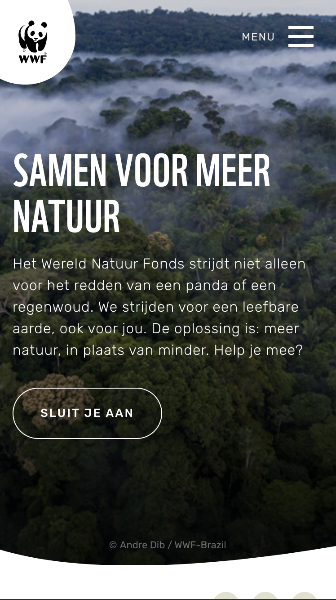
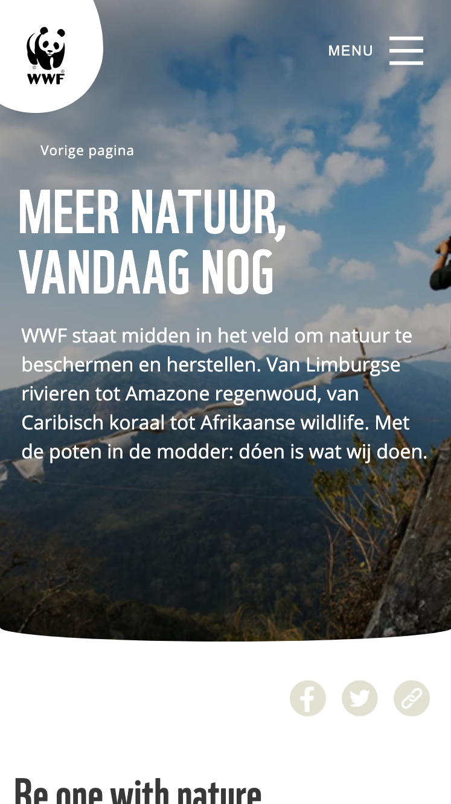

# Procesverslag
Markdown is een simpele manier om HTML te schrijven.  
Markdown cheat cheet: [Hulp bij het schrijven van Markdown](https://github.com/adam-p/markdown-here/wiki/Markdown-Cheatsheet).

Nb. De standaardstructuur en de spartaanse opmaak van de README.md zijn helemaal prima. Het gaat om de inhoud van je procesverslag. Besteedt de tijd voor pracht en praal aan je website.

Nb. Door *open* toe te voegen aan een *details* element kun je deze standaard open zetten. Fijn om dat steeds voor de relevante stuk(ken) te doen.

## Jij

  
uitwerken voor kick-off werkgroep

  ### Auteur:
  Bibi Unger

  #### Je startniveau:
  Blauw

  #### Je focus:
  Surface plane
 

## Je website

  
uitwerken voor kick-off werkgroep

  ### Je opdracht:
[  link naar de website die je gaat namaken óf de naam/omschrijving van je eigen ontwerp](https://www.wwf.nl/)

  #### Screenshot(s) van de eerste pagina (small screen): 
  WWF  
  

  #### Screenshot(s) van de tweede pagina (small screen):
  Wat we doen  
  
 

## Toegankelijkheidstest 1/2 (week 1)

  
uitwerken na test in 2e werkgroep

  ### Bevindingen

In de eerste week van dit blok heb ik de toegankelijkheidstest toegepast op de WWF site, door de website en code te bekijken en ondertussen de WCAG checklist af te gaan. Door dit te doen ben ik achter een aantal bevindingen gekomen.

De content is erg toegankelijk. De website gebruikt duidelijke tekst die iedereen kan begrijpen, en de namen van de links en buttons hebben duidelijke en bijpassende omschrijvingen. 

De HTML was over het algemeen toegankelijk. Er werd wel aangegeven dat er wat fouten in de HTML zaten. 

Voor toetsenbord-gebruikers is de website toegankelijk. Als er elementen geselecteerd worden met de tab key kun je duidelijk zien dat die geselecteerd is, doordat er een blauwe rand om heen verschijnt. 

Ook voor mobiele gebruikers is de website toegankelijk. Er zit genoeg ruimte tussen de interactieve elementen en de site werkt zowel horizontaal als verticaal.

De heading elementen werden gebruikt om content te introduceren en de headings hadden over het algemeen een logische volgorde. Alleen werden er wel op sommige pagina’s meerdere H1’s gebruikt op dezelfde pagina. 

Het viel me op dat er weinig listen voorkomen in de code van de website, en een aantal dingen die je listen zou kunnen zetten niet in een listen stonden. 

Er is niet veel sprake van toegankelijkheid voor gebruikers die een screenreader. gebruiken. De foto’s op de website hebben namelijk geen alt tekst. Dit komt omdat de meeste foto’s achtergrondfoto’s zijn. Echter hebben de foto’s die dat niet zijn ook geen alt tekst. 

Op de eerste section van de hoofdpage van de website wordt er een achtergrondvideo afgespeeld. Deze video wordt automatisch afgespeeld en kan niet gepauzeerd worden. Op dit gebied is de website dus niet erg toegankelijk. Wel zijn de animaties op de website subtiel en vallen ze niet te veel op. 

De controls op de website zijn over het algemeen toegankelijk. Alleen worden er geen button elementen gebruikt voor de buttons op de website. 

De website support alleen maar normale instellingen. Als ik dark en light mode of high-contrast mode aanzet, of de tekst grootte verhoog, gebeurt er niks op de website. Wel is de website toegankelijk voor mensen die kleurenblind zijn, aangezien kleur niet de enige manier is om informatie te rangschikken, en is er een hoog contrast tussen de achtergrond en tekst. 

## Breakdownschets (week 1)

  
uitwerken na afloop 3e werkgroep

  ### de hele pagina: 
  

  ### dynamisch deel (bijv menu): 
  

  ### wellicht nog een dynamisch deel (bijv filter): 
  

## Voortgang 1 (week 2)

  
uitwerken voor 1e voortgang

  ### Stand van zaken
In de tweede week van het blok had ik alleen nog maar de HTML van de eerste page. Het schrijven van de code hiervoor ging over het algemeen wel goed, maar ik had wel een paar vragen. 

  ### Agenda voor meeting
  samen met je groepje opstellen

  | student 1      | student 2          | student 3    | student 4        |
  | ---            | ---                | ---          | ---              |
  | dit bespreken  | en dit             | en ik dit    | en dan ik dat    |
  | en dat ook nog | dit als er tijd is | nog een punt | dit wil ik zeker |
  | ...            | ...                | ...          | ...              |

  ### Verslag van meeting
  hier na afloop snel de uitkomsten van de meeting vastleggen

  - punt 1
  - punt 2
  - nog een punt
  - ...

## Voortgang 2 (week 3)

  
uitwerken voor 2e voortgang

  ### Stand van zaken
  hier dit ging goed & dit was lastig (neem ook screenshots op van delen van je website en code)

  ### Agenda voor meeting
  samen met je groepje opstellen

  | student 1      | student 2          | student 3    | student 4        |
  | ---            | ---                | ---          | ---              |
  | dit bespreken  | en dit             | en ik dit    | en dan ik dat    |
  | en dat ook nog | dit als er tijd is | nog een punt | dit wil ik zeker |
  | ...            | ...                | ...          | ...              |

  ### Verslag van meeting
  hier na afloop snel de uitkomsten van de meeting vastleggen

  - punt 1
  - punt 2
  - nog een punt
- ...

## Toegankelijkheidstest 2/2 (week 4)

  
uitwerken na test in 9e werkgroep

  ### Bevindingen
  Lijst met je bevindingen die in de test naar voren kwamen (geef ook aan wat er verbeterd is):

## Voortgang 3 (week 4)

  
uitwerken voor 3e voortgang

  ### Stand van zaken
  hier dit ging goed & dit was lastig (neem ook screenshots op van delen van je website en code)

  ### Agenda voor meeting
  samen met je groepje opstellen

  | student 1      | student 2          | student 3    | student 4        |
  | ---            | ---                | ---          | ---              |
  | dit bespreken  | en dit             | en ik dit    | en dan ik dat    |
  | en dat ook nog | dit als er tijd is | nog een punt | dit wil ik zeker |
  | ...            | ...                | ...          | ...              |

  ### Verslag van meeting
  hier na afloop snel de uitkomsten van de meeting vastleggen

  - punt 1
  - punt 2
  - nog een punt
  - ...

## Eindgesprek (week 5)

  
uitwerken voor eindgesprek

  ### Je uitkomst - karakteristiek screenshots:
  

  ### Dit ging goed/Heb ik geleerd: 
  Korte omschrijving met plaatjes

  

  ### Dit was lastig/Is niet gelukt:
  Korte omschrijving met plaatjes

  

## Bronnenlijst

  
continu bijhouden terwijl je werkt

  Nb. Wees specifiek ('css-tricks' als bron is bijv. niet specifiek genoeg). 
  Nb. ChatGpT en andere AI horen er ook bij.
  Nb. Vermeld de bronnen ook in je code.

  1. bron 1
  2. bron 2
  3. ...

