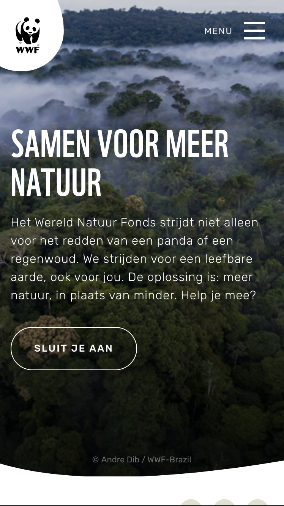
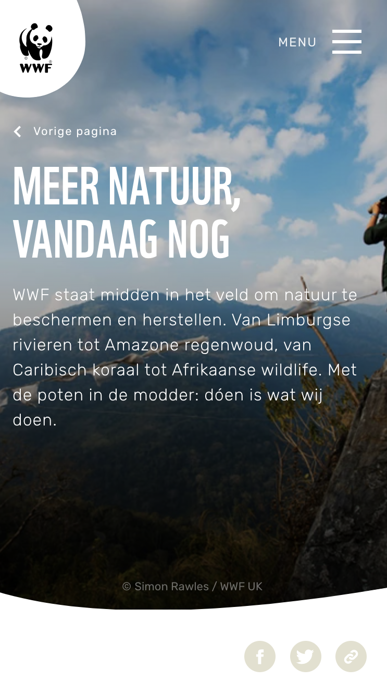
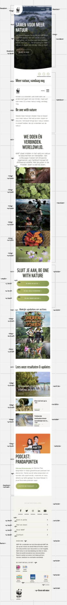
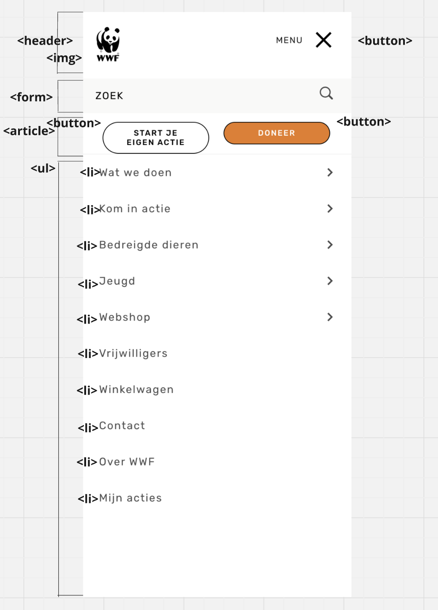

# Procesverslag
Markdown is een simpele manier om HTML te schrijven.  
Markdown cheat cheet: [Hulp bij het schrijven van Markdown](https://github.com/adam-p/markdown-here/wiki/Markdown-Cheatsheet).

Nb. De standaardstructuur en de spartaanse opmaak van de README.md zijn helemaal prima. Het gaat om de inhoud van je procesverslag. Besteedt de tijd voor pracht en praal aan je website.

Nb. Door *open* toe te voegen aan een *details* element kun je deze standaard open zetten. Fijn om dat steeds voor de relevante stuk(ken) te doen.

## Jij

  
uitwerken voor kick-off werkgroep

  ### Auteur:
  Bibi Unger

  #### Je startniveau:
  Blauw

  #### Je focus:
  Surface plane
 

## Je website

  
uitwerken voor kick-off werkgroep

  ### Je opdracht:
[  link naar de website die je gaat namaken óf de naam/omschrijving van je eigen ontwerp](https://www.wwf.nl/)

  #### Screenshot(s) van de eerste pagina (small screen): 
  WWF  
  

  #### Screenshot(s) van de tweede pagina (small screen):
  Wat we doen  
  
 

## Toegankelijkheidstest 1/2 (week 1)

  
uitwerken na test in 2e werkgroep

  ### Bevindingen

In de eerste week van dit blok heb ik de toegankelijkheidstest toegepast op de WWF site, door de website en code te bekijken en ondertussen de WCAG checklist af te gaan. Door dit te doen ben ik achter een aantal bevindingen gekomen.

De content is erg toegankelijk. De website gebruikt duidelijke tekst die iedereen kan begrijpen, en de namen van de links en buttons hebben duidelijke en bijpassende omschrijvingen. 

De HTML was over het algemeen toegankelijk. Er werd wel aangegeven dat er wat fouten in de HTML zaten. 

Voor toetsenbord-gebruikers is de website toegankelijk. Als er elementen geselecteerd worden met de tab key kun je duidelijk zien dat die geselecteerd is, doordat er een blauwe rand om heen verschijnt. 

Ook voor mobiele gebruikers is de website toegankelijk. Er zit genoeg ruimte tussen de interactieve elementen en de site werkt zowel horizontaal als verticaal.

De heading elementen werden gebruikt om content te introduceren en de headings hadden over het algemeen een logische volgorde. Alleen werden er wel op sommige pagina’s meerdere H1’s gebruikt op dezelfde pagina. 

Het viel me op dat er weinig listen voorkomen in de code van de website, en een aantal dingen die je listen zou kunnen zetten niet in een listen stonden. 

Er is niet veel sprake van toegankelijkheid voor gebruikers die een screenreader. gebruiken. De foto’s op de website hebben namelijk geen alt tekst. Dit komt omdat de meeste foto’s achtergrondfoto’s zijn. Echter hebben de foto’s die dat niet zijn ook geen alt tekst. 

Op de eerste section van de hoofdpage van de website wordt er een achtergrondvideo afgespeeld. Deze video wordt automatisch afgespeeld en kan niet gepauzeerd worden. Op dit gebied is de website dus niet erg toegankelijk. Wel zijn de animaties op de website subtiel en vallen ze niet te veel op. 

De controls op de website zijn over het algemeen toegankelijk. Alleen worden er geen button elementen gebruikt voor de buttons op de website. 

De website support alleen maar normale instellingen. Als ik dark en light mode of high-contrast mode aanzet, of de tekst grootte verhoog, gebeurt er niks op de website. Wel is de website toegankelijk voor mensen die kleurenblind zijn, aangezien kleur niet de enige manier is om informatie te rangschikken, en is er een hoog contrast tussen de achtergrond en tekst. 

## Breakdownschets (week 1)

  
uitwerken na afloop 3e werkgroep

  ### de hele pagina: 
  

  ### dynamisch deel (bijv menu): 
  

## Voortgang 1 (week 2)

  
uitwerken voor 1e voortgang

  ### Stand van zaken
In de tweede week van het blok had ik alleen nog maar de HTML van de eerste page. Het schrijven van de code hiervoor ging over het algemeen wel goed, maar ik had wel een paar vragen. 

  ### Agenda voor meeting
  samen met je groepje opstellen

  | student 1      | student 2          | student 3    | student 4        |
  | ---            | ---                | ---          | ---              |
  | dit bespreken  | en dit             | en ik dit    | en dan ik dat    |
  | en dat ook nog | dit als er tijd is | nog een punt | dit wil ik zeker |
  | ...            | ...                | ...          | ...              |

We hebben voor de meeting niet overlegd over welke vragen we wilden stellen. In plaats daarvan hebben we allemaal individueel vragen gesteld. Ik wilde wat vragen stellen over hoe je sections en articles ook al weer moest gebruiken, aangezien ik dit niet meer helemaal wist. Ook had ik alvast wat vragen over css en hoe je een hamburgermenu maakt. 

  ### Verslag van meeting
  hier na afloop snel de uitkomsten van de meeting vastleggen

  - Ik weet nu beter hoe ik sections en articles moet gebruiken. Ook heb ik geleerd dat ik niet alles in articles of sections hoef te zetten, maar ook wat dingen kan groeperen door ze in een list te zetten. 
  - De andere vragen die ik had gaan in latere werkgroepen en opdrachten aan bod komen

## Voortgang 2 (week 3)

  
uitwerken voor 2e voortgang

  ### Stand van zaken
  In de derde week heb ik de html van de tweede pagina geschreven. Ook ben ik begonnen met de CSS. Zo heb ik kleuren, lettertypes en achtergrondfoto's toegevoegd. Ik had wel wat moeite met het positioneren van items, maar na het maken van de opdrachten in de lessen ging dit beter. 

Ik kon niet bij het tweede voortgangsgesprek zijn. Ik ben van plan om volgende week tijdens de lessen om feedback vragen.  
Wel had ik een vraag over hoe je de hoeken van een image los van elkaar stylt. Dit heb ik online opgezocht, waarbij https://css-tricks.com/almanac/properties/b/border-radius/ me heeft geholpen. 

 

## Toegankelijkheidstest 2/2 (week 4)

  
uitwerken na test in 9e werkgroep

  ### Bevindingen

In de vierde week van dit blok heb ik de toegankelijkheidstest toegepast op mijn eigen website. Dit heb ik gedaan door de site en de code te bekijken en de WCAG checklist af te gaan. Ik was tijdens het uitvoeren van de test al redelijk ver met mijn website, maar had hem nog niet helemaal af. Ik had in elk geval genoeg af om de test uit te voeren. 

De content was erg toegankelijk, net als de content van de WWF website. Dit komt omdat de content op de WWF website en mijn eigen site vrijwel hetzelfde is. 

De HTML was ook toegankelijk en er zaten geen fouten in. Dit hoef ik dus niet meer aan te passen. 

De website is goed met een toetsenbord bestuurbaar, doordat er een duidelijke rand verschijnt om elementen als ze geselecteerd worden met de tab key. Hier hoef ik niks aan te veranderen. 

Ik heb mijn website live gezet op Github en getest op mijn telefoon. Hier is de website redelijk toegankelijk, behalve als ik mijn telefoon kantel. De site beweegt wel mee maar de margins kloppen niet helemaal meer. Ik moet even kijken hoe ik dit kan fixen. 

Over het algemeen kloppen de headings, behalve dat er op allebei de pagina’s meerdere H1-elementen staan. Ook zag ik dat ik een headingselement (een H3) had gebruikt voor een quote. Deze dingen moet ik dus aanpassen. 

Een aantal elementen die bij elkaar passen staan in listen. Wel zijn er een aantal elementen die eigenlijk ook in een list zouden kunnen staan, maar niet in een list staan, zoals social media icons en sommige foto’s. Ik moet dus nog even kijken of ik deze elementen wel in listen kan zetten. 

Alle foto’s die in de html staan hebben een alt tekst, zodat de website toegankelijker is voor mensen die een screenreader gebruiken. Alleen de achtergrond foto’s (die ik er heb ingezet met css) hebben geen alt tekst. 

Bij sommige foto’s wordt er een audio afgespeeld als erop geklikt wordt. De audio’s kunnen echter niet gepauzeerd worden, wat de website minder toegankelijk maakt. Ik moet dus nog even kijken hoe ik ervoor kan zorgen dat gebruikers de audio wel kunnen pauzeren. De animaties op de website zijn wel subtiel, dus daar hoef ik niks aan de veranderen.  

De controls zijn toegankelijk. De buttons en links zijn herkenbaar als buttons en link, er worden button elementen voor buttons gebruikt en a elementen voor links. 

Je kan geen dark/light mode aanzetten of de tekst vergroten op mijn website. Ik ga nog kijken of ik dit eventueel wil veranderen. Wel is er een hoog contrast tussen de achtergrond en tekst. 

Op de WWF website worden er wel veel achtergondfoto’s gebruikt voor tekst, dus heb ik dit ook veel gedaan. Om die teksten leesbaarder te maken heb ik de achtergrondfoto’s wat donkerder gemaakt, door achtergrondkleuren toe te voegen en de blend-mode op multiply te zetten.  

Conclusie: 
Na het uitvoeren van de test ben ik tot de conclusie gekomen dat er nog een aantal dingen zijn die ik moet aanpassen of uitzoeken. Zo moet ik ervoor zorgen dat er maximaal een H1 is op allebei de pages, en dat ik geen headingselementen gebruik voor elementen die geen headings zijn. Ook moet ik kijken of ik meer elementen in listen kan zetten en hoe ik de website toegankelijker voor mobiel kan maken. Verder moet ik kijken hoe ik ervoor zorg dat de audio’s gepauzeerd kunnen worden.

Update:
Ik heb de headings toegankelijker gemaakt door de H1's H2's te maken en die indivueel te stijlen, en de H3 die ik had gebruikt voor een quote te vervangen met een 'p'. Verder heb ik de de website toegankelijker voor mobiels gemaakt door een '@media only screen and (orientation: landscape)' toe te voegen en de margins te verhogen. Ik heb er voor gekozen om de audio's weg te halen, aangezien het de website rommelig zou maken als ik pauzeknoppen toe zou voegen. 

## Voortgang 3 (week 4)

  
uitwerken voor 3e voortgang

  ### Stand van zaken
  Voor het derde voortgangsgesprek was ik heel wat verder met mijn css. Ik ben vooral bezig geweest met het positioneren van items en (achtergrond)foto's. Ook ben ik begonnen aan de surface plane, door bezig te zijn met een carrousel en (het stylen van) een formulier. Verder heb ik een hamburgermenu gemaakt met javascript. 
  Wel had ik wat vragen, voornamelijk over de surface plane. 

  ### Agenda voor meeting
  samen met je groepje opstellen

  | student 1      | student 2          | student 3    | student 4        |
  | ---            | ---                | ---          | ---              |
  | dit bespreken  | en dit             | en ik dit    | en dan ik dat    |
  | en dat ook nog | dit als er tijd is | nog een punt | dit wil ik zeker |
  | ...            | ...                | ...          | ...              |

Aangezien we allemaal andere vragen hadden, hebben we individueel vragen gesteld. Ik heb vooral vragen gesteld over wat allemaal precies bij de surface plane hoort en werd ik geholpen bij het uitzoeken van meer surface plane opdrachten. Ook had ik vragen over welke tags ik wel en niet mocht gebruiken. 

  ### Verslag van meeting
  hier na afloop snel de uitkomsten van de meeting vastleggen

  - Ik moet nog meer dingen uitzoeken voor de surface plane. Ik wil buiten de dingen die ik al heb uitgekozen (een extra micro-interactie met het hamburgermenu, een gestylt formulier en een carrousel) animaties op controles en een scroll-driven animatin toevoegen op mijn website. 
  - Een carrousel hoef je niet volledig met javascript te maken
  - Je mag (bijna) geen classes en id's gebruiken, tenzij het niet anders kan en op je tweede pagina. 
  - ...

## Eindgesprek (week 5)

  
uitwerken voor eindgesprek

  ### Je uitkomst - karakteristiek screenshots:
  

  ### Dit ging goed/Heb ik geleerd: 
  Korte omschrijving met plaatjes

  

  ### Dit was lastig/Is niet gelukt:
  Korte omschrijving met plaatjes

  

## Bronnenlijst

  
continu bijhouden terwijl je werkt

  Nb. Wees specifiek ('css-tricks' als bron is bijv. niet specifiek genoeg). 
  Nb. ChatGpT en andere AI horen er ook bij.
  Nb. Vermeld de bronnen ook in je code.

  1. [bron 1] (https://codepen.io/shooft/pen/JjQLVeB - voor hulp bij de menu button
  2. [bron 2] https://www.w3schools.com/tags/att_input_placeholder.asp - voor hulp bij de form (label en placeholder tag)
  3. [bron 3] https://www.w3schools.com/jsref/prop_win_scrolly.asp - voor hulp bij een transitie van de header als er gescrold wordt
  4. [bron 4] https://www.w3schools.com/cssref/pr_background-blend-mode.php - voor hulp met de background image en blend mode
  5. [bron 5] https://www.w3schools.com/css/css3_gradients.asp - voor hulp met de button gradient
  6. [bron 6] https://css-tricks.com/almanac/properties/b/border-radius/ - voor hulp bij de border radius van sections en images
  7. [bron 7] https://chatgpt.com/ - om een class op een span toe te voegen en weer laten verwijderen als er op een andere span wordt geklikt (door te vragen: hoe haal ik de class van een span er af als er op een andere span wordt geklikt)
  8. [bron 8] https://www.w3schools.com/jsref/met_domtokenlist_contains.asp voor de classList.contains tag
  9. [bron 9] https://www.w3schools.com/cssref/css3_pr_mediaquery.php - voor de media query: landscape tag

